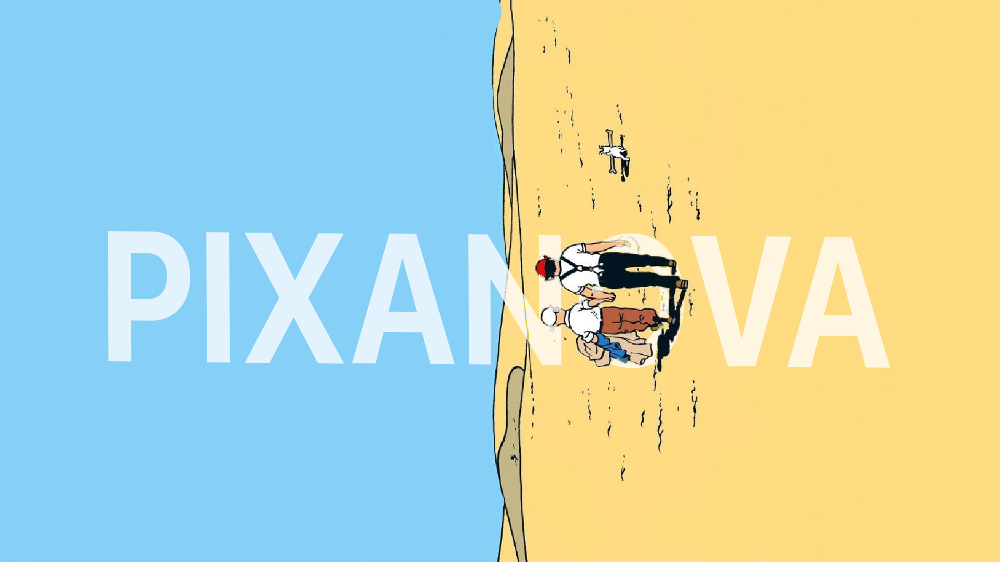

# Pixanova 3D Screen Configurator (POC)

POC web app in Next.js that lets a renter unlock a 3D LED screen simulator with a rental code, upload media, group/ungroup screens, and preview mapped content.

## Tech stack

- Next.js (App Router) + React + TypeScript
- Tailwind CSS
- Three.js via `@react-three/fiber` and `@react-three/drei`
- Zustand for app state

## Routes

- `/` landing stub
- `/preview` main 3D simulator

## Local setup

1. Install deps:

```bash
npm install
```

2. Run dev server:

```bash
npm run dev
```

3. Open:

- `http://localhost:3000`
- `http://localhost:3000/preview`

## Production build

```bash
npm run build
npm start
```

## Docker

Build and run with Docker Compose:

```bash
docker compose up --build
```

Then open `http://localhost:3000/preview`.

## Main POC behavior

- Access modal on `/preview`: accepts any non-empty rental code.
- Default scene starts with 3 screens.
- Upload media to one screen or to a selected group.
- Supported formats: MP4, MOV, JPG, PNG, GIF.
- Grouping (`Connect selected`) spans one media across grouped screens.
- Detach or ungroup copies active group media/playback timestamp to detached screens.
- Camera controls: orbit, pan, zoom + Front / Left / Right / Top / Reset buttons.
- Add virtual extra screens beyond rented count with warning message.
- `Ask for a live preview` button is UI-only and shows a `Coming soon` toast.

## Shortcuts

- `G`: connect selected screens
- `U`: ungroup or disconnect
- `Delete` / `Backspace`: remove selected
- `R`: reset view

## Known limitations (POC)

- No backend auth: code validation is client-side only.
- No real hardware push or live preview backend.
- Group UV projection is optimized for axis-aligned screen surfaces.
- GIF playback depends on browser texture behavior and may not be perfectly smooth.
- Media object URLs are not persisted across browser restarts.
